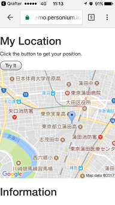

# i-am-here
A simple web app that save photo and location to a Personium cell (Personal Data Store) and share with the information with family and friends.  

# What needs to be implemented  
1. ~~Google API key~~  
1. ~~Get location function~~  
1. ~~Show position on Google Map~~  
1. Take photo (activate camera)  
1. Show thumbnail  
1. User Authentication
1. App's box construction
1. Data design  
1. Save data (raw image, location, time, etc.) to own cell  
1. Get location histories  
1. Share with other users  
1. See other user's lcoation histories  

# Prototype  
Currently 1 - 3 is implemented.  
Open [this](https://demo.personium.io/dixonsiu/__/getLocation.html) and click the "Try it" button to display the Google Map.  
  
